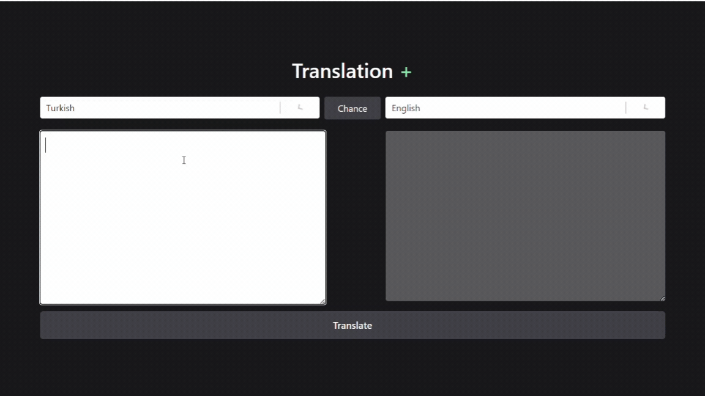

## Translate-App

Dans ce projet, une application de traduction a été développée en utilisant React, Redux Toolkit et thunk. Les utilisateurs peuvent traduire du texte entre différentes langues et échanger les langues. L'application récupère les options de langue depuis une API et traduit le texte dans la langue cible.

## Bibliothèques

- axios
- @reduxjs/toolkit
- react-redux
- react-select
- tailwind

## api

https://rapidapi.com/

### GIF

